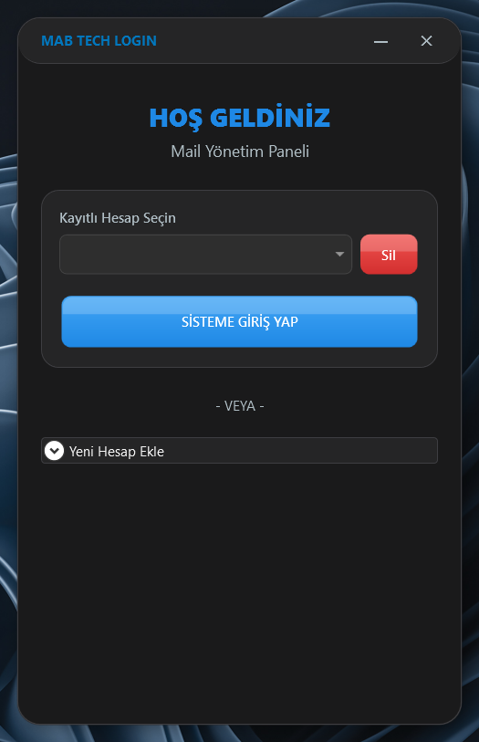
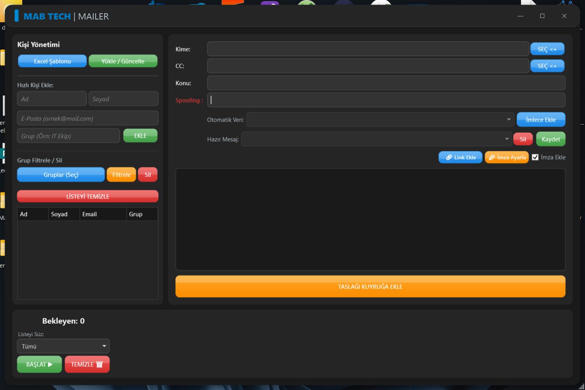
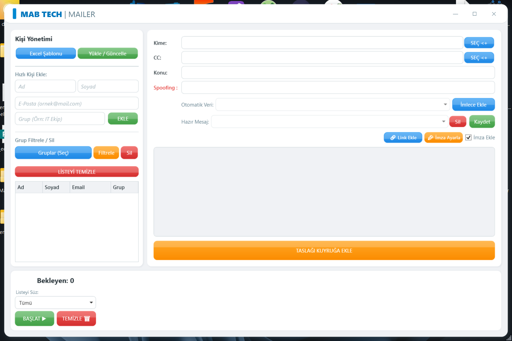

<div align="center">

# 📬 MAB Mailer

**Bulk & personalized email sending desktop application**

[](https://dotnet.microsoft.com/download/dotnet-framework/net472)
[]()
[]()
[](LICENSE)
[]()

[**⬇️ Download / İndir**](https://mabtech.me/Home/ProjectDetail/9)

</div>

---

## 📸 Screenshots

<div align="center">

| Login | Main — Dark | Main — Light |
|:---:|:---:|:---:|
|  |  |  |

</div>

---

## ✨ Features

- 📋 **Bulk Import from Excel** — Generate a template, fill it in, and import contacts instantly
- 👥 **Group Management** — Organize contacts into groups, filter, and send targeted emails
- ✉️ **Personalized Emails** — Use variables like `{Name}`, `{Surname}`, `{Email}` and dynamic columns
- 📝 **Message Templates** — Save and reuse frequently sent messages
- 🔗 **HTML Links** — Insert clickable hyperlinks directly into the email body
- ✒️ **Signature Support** — Automatically append your email signature
- 📮 **Queue System** — Queue drafts, bulk send, and track delivery status
- 🔄 **Multi-Account** — Store multiple SMTP accounts and switch between them easily
- 🌗 **Auto Theme** — Automatically follows Windows Light / Dark theme
- 🔀 **Spoofing** — Customize the sender address (if SMTP server allows)

---

## ✨ Özellikler

- 📋 **Excel'den Toplu Aktarım** — Şablon oluştur, doldur ve kişileri anında içe aktar
- 👥 **Grup Yönetimi** — Kişileri grupla, filtrele ve hedefli e-posta gönder
- ✉️ **Kişiselleştirilmiş E-posta** — `{Ad}`, `{Soyad}`, `{Email}` ve dinamik sütun değişkenleri kullan
- 📝 **Mesaj Şablonları** — Sık gönderilen mesajları kaydet ve tekrar kullan
- 🔗 **HTML Link** — Mail içeriğine tıklanabilir bağlantı ekle
- ✒️ **İmza Desteği** — Otomatik e-posta imzası ekleme
- 📮 **Kuyruk Sistemi** — Kuyruğa ekle, toplu gönder ve durumu takip et
- 🔄 **Çoklu Hesap** — Birden fazla SMTP hesabı kaydet, kolayca geçiş yap
- 🌗 **Otomatik Tema** — Windows Açık / Koyu temasına otomatik uyum sağlar
- 🔀 **Spoofing** — Gönderen adresini özelleştir (SMTP sunucusu izin veriyorsa)

---

## 🛠️ Requirements

| | |
|---|---|
| **OS** | Windows 10 / 11 (x64) |
| **Runtime** | [.NET Framework 4.7.2](https://dotnet.microsoft.com/download/dotnet-framework/net472) |
| **IDE** *(dev only)* | Visual Studio 2022+ |

---

## 🛠️ Gereksinimler

| | |
|---|---|
| **İşletim Sistemi** | Windows 10 / 11 (x64) |
| **Çalışma Zamanı** | [.NET Framework 4.7.2](https://dotnet.microsoft.com/download/dotnet-framework/net472) |
| **IDE** *(geliştirici)* | Visual Studio 2022+ |

---

## 🚀 Getting Started

### 📥 End User

> Download the latest version from [**here**](https://mabtech.me/Home/ProjectDetail/9) and run the installer.
> The app creates its database automatically on first launch.

### 👨‍💻 Developer

```bash
git clone https://github.com/Mertcan-BZTPRK/MAB-Mailer.git
cd MAB-Mailer
```

1. Open `MAB Mailer.slnx` in **Visual Studio**
2. Wait for **NuGet Restore** to complete
3. **Build → Start** ▶️

---

## 🚀 Başlangıç

### 📥 Kullanıcı

> En son sürümü [**buradan**](https://mabtech.me/Home/ProjectDetail/9) indirin ve yükleyiciyi çalıştırın.
> Uygulama ilk açılışta veritabanını otomatik olarak oluşturur.

### 👨‍💻 Geliştirici

```bash
git clone https://github.com/Mertcan-BZTPRK/MAB-Mailer.git
cd MAB-Mailer
```

1. `MAB Mailer.slnx` dosyasını **Visual Studio** ile açın
2. **NuGet Restore** işleminin tamamlanmasını bekleyin
3. **Build → Start** ▶️

---

## 📦 Tech Stack / Teknolojiler

| Technology | Purpose / Amaç |
|---|---|
| **WPF** | Desktop UI framework |
| **Microsoft.Data.Sqlite** | Local database (SQLite) |
| **ClosedXML** | Excel read/write |
| **Newtonsoft.Json** | JSON serialization |
| **Inno Setup** | Windows installer packaging |

---

## 📁 Project Structure / Proje Yapısı

```
MAB Mailer/
│
├── App.xaml/.cs                    # Entry point, theme loading
├── LoginWindow.xaml/.cs            # Login screen, account management
├── MainWindow.xaml/.cs             # Main screen, mail composition
│
├── DatabaseService.cs              # SQLite CRUD operations
├── MailService.cs                  # SMTP email sending
├── ExcelService.cs                 # Excel template & import
├── TemplateEngine.cs               # Variable parsing ({Name}, {Surname}...)
├── ThemeService.cs                 # Windows theme detection
├── GlobalSettings.cs               # Runtime session settings
│
├── CustomAlert.xaml/.cs            # Custom alert/confirm dialog
├── LinkWindow.xaml/.cs             # HTML link insertion dialog
├── TemplateNameWindow.xaml/.cs     # Template save dialog
├── InputBox.cs                     # Numeric input dialog
│
├── EmailAccount.cs                 # Account model
├── Recipient.cs                    # Recipient model
├── RecipientGroup.cs               # Group model
├── MailDraft.cs                    # Queue item model
└── MessageTemplate.cs              # Message template model
```

---

## 🤝 Contributing

Contributions are welcome! Feel free to open an **Issue** or submit a **Pull Request**.

## 🤝 Katkıda Bulunma

Katkılarınızı bekliyoruz! **Issue** açabilir veya **Pull Request** gönderebilirsiniz.

---

## 📄 License / Lisans

This project is licensed under the [MIT License](LICENSE).

Bu proje [MIT Lisansı](LICENSE) ile lisanslanmıştır.

---

<div align="center">

Design by [**Mertcan**](https://github.com/Mertcan-BZTPRK)

</div>
